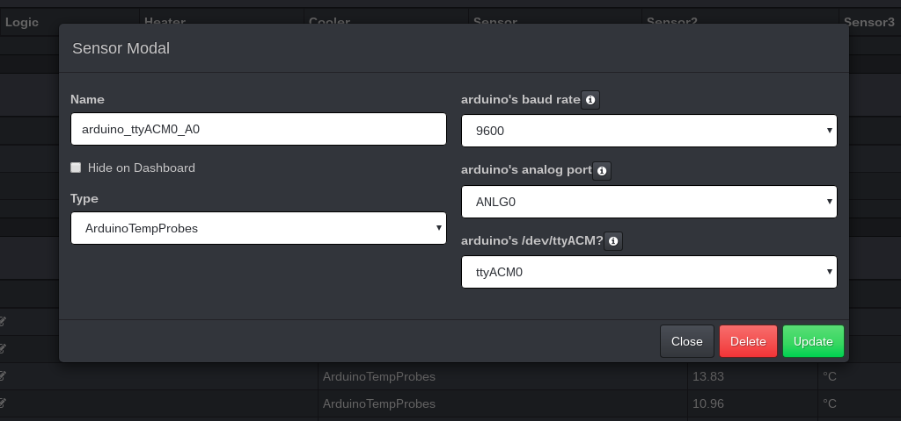
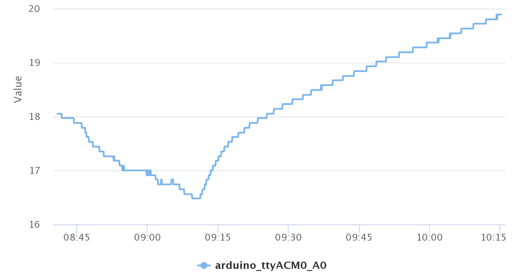
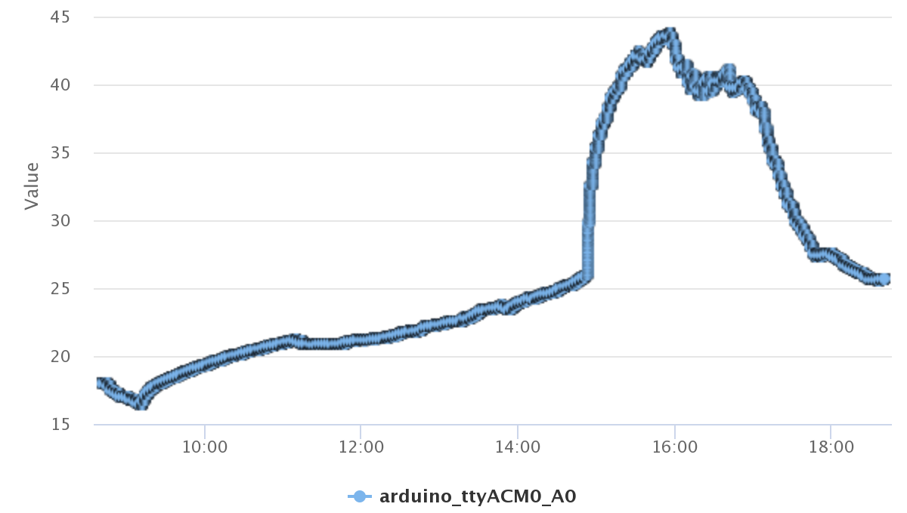

## CraftBeerPi3 Arduino Temperature Probes

### Introduction

The **CraftBeerPi3 Arduino Temperature Probes (CBP3ATP)** plugin connects via serial to an arduino microcontroller board and reads out temperature probes periodically.

### Hardware Setup

For the current setup a usual _arduino UNO or leonardo_ board with six analog inputs, and **up to six _Negative Temperature Coefficient (NTC)_ cable probes** are used. The **arduino project: [Arduino Serial State Temperature Probes](https://github.com/graetz23/ArduinoSerialStateTempProbes)** can be flashed out of the box.

In [CraftBeerPi3](https://github.com/Manuel83/craftbeerpi3) you place this plugin to **_~/craftbeerpi3/modules/plugins/_** by:

**git clone https://github.com/graetz23/craftbeerpi3ArduinoTempProbes**

 or **download / unzip** it from the [release page](https://github.com/graetz23/craftbeerpi3ArduinoTempProbes/releases).  

Connect the arduino via an USB cable to the raspberry running CBP3. It should create a device called_ ttyACM0, ttyACM1, .., ttyACMX; you can check by bash command: _ls /dev_ or _ls /dev | grep ACM_.

### Software Setup

After _restarting_ your CraftBeerPi3 (that's important; _sudo /etc/init.d/craftbeerpiboot restart_), reload your browser (_CTRL+SHIFT+R_ for chrome, e.g.), select at the top bar _Hardware Settings_, and add a _Sensor_, select as sensor: **ArduinoTempProbes**.

You can configure the following:
  - set own name; here I took _arduino_ttyACM0_ANLG0_,
  - select the _baud rate_ the arduino runnig; default is _9600_,
  - select the _analog port: A0,A1,..,A5_ of your arduino; I took _ANLG0_, which is A0,
  - select the _serial device_ arduino has created by plugin it into the raspberry pi.

That's all.

Afterwards the sensor inits with a _zero_ value, and the NTC probe, connected to arduino, is read out cyclic. You can see the _builtin LEDs TX \& RX_ flickering periodically.

### Preview

Here is a preview on the resolution of the temperature values for a _change of around 3° celsius_ over a _time period of 90 minutes_ (NTC probe was on the table):

Another preview is about _10 hours_ of temperature values, where the NTC probe was on the table on some black ground. At around _15 pm_ direct sunlight was heating up the probe until aroung _17 pm_:

### Trouble shooting
_.. will be written / extended by reported of user problems._

### Remarks
If you do not have _some_ NTC around, you can try this project even without, due to the fact that an _open_ analog input is _floating_; you will get random temperature values.

I created this plugin (and the arduino project), while I hope to have several advantages:
  - **independent** and parallel **monitoring temperatures** _without_ CBP3:
    - connecting a _20x4 LCD_ to arduino, **allows to drive the brewing process manually**,
    - the _updating_ rates of the temperatures are much faster than in CBP3.
  - **more stability on reading temperature**, while driving _the most simple_ sensors (resistors) possible,
  - **extending the arduino project**:
    - **adding _any other_ sensor (or actor)** to arduino,
    - having electronics on a _5 V_ basis with more _milliamps_ out of the box.

CBP3ATP is written in [python 2.7](https://www.python.org/) and _strongly_ dependent on: [cool Python Serial State Machine (coolPSSM)](https://github.com/graetz23/coolPythonSerialStateMachine), which is included in this repository for simplification; [coolPSSM.py](https://github.com/graetz23/coolPythonSerialStateMachine/blob/master/coolPSSM.py).

Everything was coded using:

  - [**CraftBeerPi3**](https://github.com/Manuel83/craftbeerpi3) home brewing automation,
  - [**python 2.7**](https://www.python.org/) programming language,
  - [**arduino**](https://www.arduino.cc/) project,
  - [**arduino IDE**](https://www.arduino.cc/en/main/software) for _serial debugging_,
  - [**arduino Makefile**](https://github.com/sudar/Arduino-Makefile) for automated building,
  - [**atom**](https://atom.io/) editor,
  - [**Gnome**](https://www.gnome.org/) as window manager,
  - [**debian**](https://www.debian.org/) GNU/Linux,
  - and [**raspbian**](https://www.raspbian.org/) GNU/Linux

have fun :-)

## ChangeLog

**20200411**
  - published project in [version 1.0](https://github.com/graetz23/craftbeerpi3ArduinoTempProbes/releases)
  - created README
